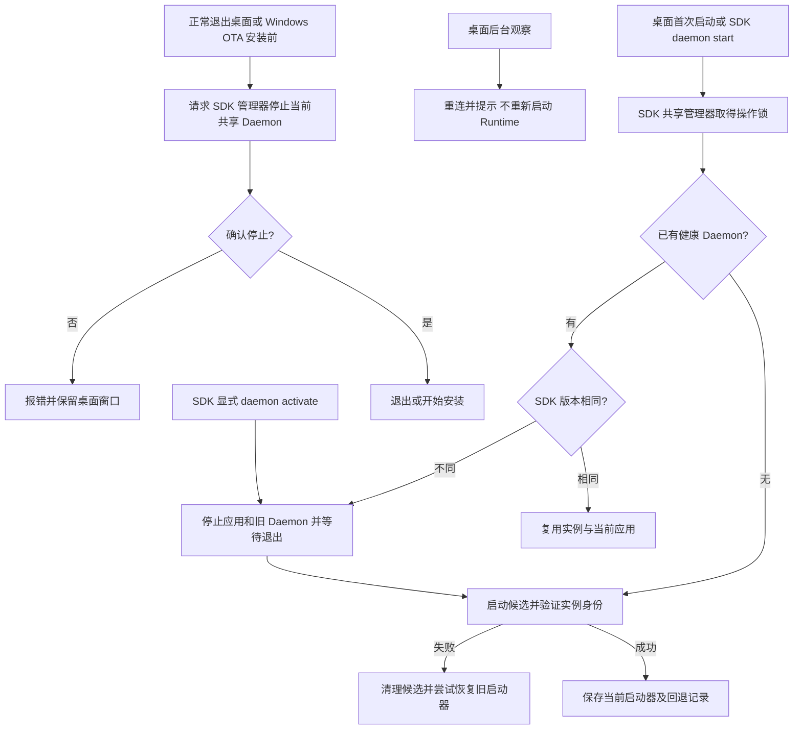

# 共享 Daemon 与 Application 版本维护

## 启动等待与取消

候选及回退 Runtime 的就绪等待不设固定总时限。进程退出、身份不一致等真实错误仍会终止激活；状态接口暂时不可用则继续探测。网络请求、锁竞争和停止进程宽限期仍有各自边界，不是启动就绪总时限。

桌面退出通过本次激活专用的 WATCHER_RUNTIME_CANCEL_FILE 标记取消等待；SDK 只清理自己创建的候选进程树，不提交启动记录、不启动回退实例。资源发布、身份查询按需加载服务依赖；业务路由和版本复用规则不变。

## 约定

SDK 应用运行入口 ensure_runtime 也委托共享管理器，删除独立的 Popen 和 10 秒轮询路径。已有实例直接复用；没有实例时使用已保存的启动器或当前 SDK Python，由同一管理器负责并发锁、就绪确认、失败进程清理及启动指针。Windows 使用当前 Python 和隐藏进程标志，不额外改用 pythonw 解释器。显式 daemon start 的版本切换策略与应用运行的复用策略保持分离。

冻结 Runtime 管理器激活自身可执行文件时，在当前已成功加载的进程中计算候选身份，避免重复启动 onefile 解压进程；其他可执行文件仍单独启动校验。候选与实际 Daemon 继续计算完整资源摘要，并在就绪时比较 build_id，校验失败不提交启动指针。桌面应独立呈现启动中、启动失败及断线重连，不应在后台轮询中反复接管。

同一操作系统用户使用一个实例目录和一个 Daemon。SDK 是 Daemon 唯一源码来源；桌面端与 SDK CLI 都是启动及管理客户端。Application 只使用 Daemon 注入的 Desktop、Device channel，不另起 Daemon，也不改变业务透明转发规则。

| 组件 | 职责 | 不负责 |
| --- | --- | --- |
| SDK 共享管理模块 | 实例锁、启动记录、Runtime 发布与切换、失败恢复、引用登记与目录回收 | 桌面安装器和 UI |
| SDK Daemon | 唯一常驻实例，管理 Application 进程、连接和透明路由 | 随业务类型绕过 Application |
| SDK 开发/分发工具 | 创建下载源码、安装独立依赖、登记项目、调用共享管理模块 | 为每个项目另起 Daemon或自动抢占运行版本 |
| 桌面端 | 构建锁定 SDK 候选、显示状态、调用 SDK 管理/分发能力、处理 OTA 前置检查 | 维护第二份 Daemon、递归删除用户数据、实现另一套清理规则 |
| Application | 使用自己的 SDK 环境处理业务和注入通道 | 管理常驻 Daemon 或直接依赖内部 Runtime 存储路径 |

三个版本分别管理：桌面版本描述 UI 和安装器；Daemon 状态接口的 sdk_version 描述实际运行代码；Application 的 SDK 来自它自己的虚拟环境。拉取源码或更新桌面安装包不等于正在运行的 Daemon 已切换。即使版本号相同，不同源码提交也可能不同，桌面构建须锁定 SDK commit。

## 启动、联调、切换

- SDK 与桌面任意先后启动，显式启动时同 SDK 版本直接复用，不同版本停止当前应用和旧 Daemon，切换到请求方提供的版本（允许降级）。同版本即使路径、提交不同也不重启。生命周期操作使用 operation.lock，Daemon 自身持有实例锁；多个启动请求不会得到多个健康实例。
- 首次启动成功保存 current-launcher.json。普通 app run 冷启动使用记录的启动器；桌面首次启动和 SDK daemon start 选择请求方候选。同版本复用不更新启动记录。
- SDK 项目仍用自己的 Python 环境开发应用。CLI 将应用目录和解释器注册给共享 Daemon，由它创建、停止 Application 进程。
- 修改 Daemon 源码但版本号未变时，执行 `watcherobot daemon activate` 强制重载，它会停止当前应用；普通 daemon start 同版本直接复用。build_id 用于启动校验，不作为普通接管条件。
- 用户正常退出桌面会停止当前 Application 和共享 Daemon，包括 SDK 启动的实例。后台等待完成再退出，失败保留窗口提示重试。SDK 单独使用可执行 `watcherobot daemon stop`。强杀桌面、崩溃或断电不能保证退出回调执行。不要删除仍被记录的项目虚拟环境，先切换到其他有效启动器。

本地注册通过用户实例目录中的一次性文件精确授权目录与解释器，HTTP 请求不能凭空声明任意启动路径。默认应用配置仅传递白名单环境变量。这不是对同一操作系统用户的安全沙箱。

## 存储与 OTA

默认实例目录为 Windows 的 %LOCALAPPDATA%/WatcheRobot/runtime-instance，macOS/Linux 为 ~/.watcherobot/runtime-instance。测试可显式覆盖 INSTANCE_ROOT、STATE_ROOT 和端口；普通客户端必须使用同一实例目录。

桌面资源先由 SDK 校验、复制到 bundles/内容哈希，再从那里运行。应用安装使用 store 下 runtimes/内容哈希中的 Python；历史 runtime 目录保留。新版本写入新目录，不覆盖运行中的 exe、DLL、Python。哈希用于内容完整性检查，发行签名仍由打包流程负责。

显式切换先验证候选可运行，再阻止新应用启动、停止当前应用和旧 Daemon，等待 Daemon 及冻结启动器释放文件，启动候选并验证 launch_id/build_id，最后原子更新启动记录。候选启动失败时保留旧记录并尝试恢复旧 Runtime；恢复失败报告错误并保留日志。当前实现不提供掉电事务恢复。

## 自动回收与 SDK 独立使用

SDK 的 ensure/activate 成功返回后，以及应用安装/卸载完成后，尝试回收共享 bundles 和已登记应用仓库 runtimes 下的内容哈希目录。清理与启动、安装共用锁；生命周期操作繁忙时跳过。无桌面端也执行同一逻辑，不另设清理 Daemon。

- 保留 current-launcher.json、previous-launcher.json 所指的版本；后者只在成功切换到不同启动命令时轮换。
- 保留登记的应用目录、虚拟环境 pyvenv.cfg、应用安装记录（包括 staging/trash）引用的版本，以及当前用户进程的可执行文件、打开文件和映射文件引用的版本。
- 只回收目录修改时间距今超过 7 天、无上述引用的内容哈希目录。链接和 Windows junction 不作为删除目标。
- 进程权限不足、记录损坏、目录不可读或文件占用时跳过，原因记录在实例目录 cleanup-report.json；后续成功操作重试。无法完整查看进程的机器可能一直延后回收。
- 老版平铺 runtime、源码项目、安装目录和用户数据不自动递归删除，因为它们缺少完整归属信息。不会自动重建应用虚拟环境来解除引用。

仅创建 SDK 项目或下载应用源码不需要启动 Daemon，也不需要创建共享 Runtime。安装应用时登记 store；启动本地开发应用时登记应用和虚拟环境，复用唯一 Daemon。项目 SDK 可以独立更新，不会隐式替换正在工作的 Daemon。手动创建但从未通过工具登记的外部虚拟环境不应直接依赖内部 bundles/runtimes 路径。

| 场景 | 行为与验收 |
| --- | --- |
| 首次安装桌面、此前没有 SDK Daemon | 首次启动发布候选，保存启动记录，只出现一个 Daemon |
| SDK 已先启动，再首次安装桌面 | 同版本复用；不同版本停止旧应用并切换 |
| 仅 SDK 创建/下载/安装/运行应用 | 创建下载无需 Daemon；安装登记引用；运行通过共享 Daemon；不依赖桌面 |
| 新架构桌面 OTA | 下载完成后确认应用及 Daemon 已停止，再调用安装器；停止失败取消安装；新版启动按版本复用或切换 |
| 手动下载新版覆盖安装 | 共享目录内进程不占安装资源；新版首次启动同版本复用，不同版本自动切换 |
| 从旧平铺安装包首次迁移 | 覆盖前先停止旧 Daemon 和占用安装目录的应用；保留数据。旧安装器没有新检查，不能靠新版启动后代码解除覆盖前占用 |

以上矩阵须在受支持 Python 和真实安装包上验收；目录回收单测不能替代安装器覆盖测试。

新桌面 OTA 前检查实际 Runtime 来源。仍从安装目录运行的兼容 Daemon 在覆盖前停止（同版本也需要停止）；身份不完整或不能确认退出时阻止升级并报告原因。不要通过删除用户数据解决文件占用。升级到本实现前的旧桌面不具备这一检查，首次迁移应停止旧 Daemon 后安装新版。安装器、签名及 macOS 实机升级仍属于发布验收。

## 应用依赖与协议

schema 1/2 保持原有 requires_watcherobot 校验和安装行为，不强制现有应用迁移。schema 3 将两个要求分开：

~~~json
{
  "schema_version": 3,
  "id": "example.camera",
  "name": "Camera",
  "version": "1.0.0",
  "requires_sdk": ">=0.1.9,<0.2",
  "requires_daemon": {"application_protocol": ">=1,<2"},
  "supported_host_platforms": ["windows"],
  "dependencies": []
}
~~~

在干净、已经验证的应用虚拟环境内，用支持 schema 3 的 SDK 工具执行 `python -m watcherobot.distribution.dependency_lock .`，生成 app.lock.json。将清单、锁和源码一起发布到 HF 应用 Space 或 Gitee 应用仓库的固定提交。两种分发来源均使用相同的协议校验和安装流程；安装器按锁内精确版本安装全部依赖，关闭隐式依赖解析，再执行依赖一致性检查；不会使用桌面 wheel 替换锁定的应用 SDK。

锁当前只支持精确版本，不支持 URL、条件标记和包哈希；包含生成环境内的所有发行包。跨平台依赖不同的应用应分别验证、限制支持平台，不能把单个平台的锁当作跨平台保证。

旧版 CLI 不识别 schema 3，也没有共享启动器管理能力。旧 SDK 的 ApplicationContext 可通过环境注入连接 Daemon，但实际业务兼容仍需应用作者验证；新格式的校验、安装、启动管理须使用本实现之后的工具。不要仅修改清单就宣称旧 SDK 的任意业务功能兼容。后续 SDK 升级只要保持 Application 协议兼容，应用不必重新发布；需要新 SDK API 或协议破坏升级时才更新应用依赖并重新验收。

## 验收与故障定位

检查 /daemon/status 的 PID、executable、source、sdk_version、application_protocol、management_protocol 和当前 Application。桌面版本、pip 中版本、源码版本不能替代实际进程信息。

自动测试覆盖两种启动顺序、并发复用、项目授权、同版本应用不中断、强制重载停止应用、无效候选保留旧实例、退出等待、不可变目录、协议兼容与原有路由。发布时还须在 Python 3.10–3.12、Windows 安装包 OTA、macOS 签名包和真实设备上验收；当前开发机测试不能替代这些发布检查。

## 桌面接管与展示

SDK 接管不会退出桌面。桌面只观察和重连；根据 draining/launch_id 识别切换，返回应用选择页面，不自动重启默认应用或抢回版本。后台重连不启动 Runtime。用户手动重试只发起一次启动操作。

版本更新窗口只显示桌面端版本和内置 Runtime 版本。安装包读取 runtime-build.json 的 sdk_version；源码运行读取启动器选定 SDK 仓库 src/watcherobot/__init__.py 的 __version__，读取失败明确提示，不使用当前运行进程的版本替代。

## 本轮交付边界

Windows 打包入口生成安装前钩子：先从安装器临时目录运行新 SDK 的共享停止入口，成功后才覆盖安装文件；停止失败则中止安装，无需删除应用数据。共享停止先请求正常退出，再对已核验命令行、监听端口的 Runtime 进程树执行有界终止，并等待文件释放。旧实例迁移还检查当前用户及实例身份；无法确认的端口占用不会强杀。七天回收仅针对可证明无引用的受管目录，当前、回退及应用引用目录继续保留；旧安装器目录不纳入自动递归清理。Windows 安装器通过 SDK 的 --begin-installation 启动短期维护守卫：停止共享服务后，持有管理操作锁、Daemon 实例锁和 bundle 发布锁，直到安装后钩子释放。SDK 启动等待操作锁，直接 Daemon 启动无法取得实例锁，桌面发布等待 bundle 锁。安装器异常退出时守卫自动释放；不保证掉电下文件复制的原子性。Windows 真包升级和 macOS 实机测试的结果须另行记录，不能用单元测试代替。

应用创建、下载和安装不切换 Daemon；运行应用复用共享实例并执行应用协议校验。应用 SDK 依赖仍由自己的环境与锁文件管理，协议兼容时无需随桌面每次升级重新发布。

## 启动与升级流程

SDK 负责版本判定、操作锁、实例锁、应用停止、进程退出等待与回退。桌面负责提供内置候选、调用共享管理器、观察重连和用户界面。应用环境只保存自己的 SDK 依赖，不拥有第二个 Daemon。

### 国内与国际桌面并存

国内桌面固定向分发 CLI 传入 `--provider gitee`，国际桌面传入 `--provider huggingface`。应用商店、安装目录和桌面 OTA 分区不改变共享 Daemon 的实例目录，也不设置 Daemon 全局区域。创建、下载、安装仍使用 SDK 的 provider 合同；Desktop 不能另写一份分发实现。

只有一个桌面客户端时，正常退出仍停止共享 Daemon。两版同时运行时，Desktop 通过进程持有的文件锁登记客户端：退出一版保留服务，最后一版正常退出才调用 SDK 停止接口。进程崩溃释放锁，后续客户端可清理失效登记；退出失败保留登记以便重试。该登记属于桌面客户端协调，不引入第二个 Daemon 或改变 SDK CLI 的显式停止行为。安装维护仍使用 SDK 维护锁，安装期间其他桌面可能短暂断线重连。

Windows OTA 的下载失败不停止现有 Runtime；安装失败恢复桌面退出状态，后续由用户重试。操作系统强制终止桌面不等同于正常退出，不能保证执行停止回调。

## 启动就绪与端口监听

Windows 后台 Daemon、失败恢复和安装维护守卫统一使用 `CREATE_NO_WINDOW`，标准输出与错误仍写入日志。不得叠加 `DETACHED_PROCESS`，该标志会让 Windows 忽略隐藏控制台设置，虚拟环境转发到子 Python 时可能弹出黑窗。macOS/Linux 保持独立会话。此策略同时供源码和 SDK 冻结安装包使用，已有进程需要重新启动才会生效。

显式启动前仍严格验证现有服务身份。候选启动后，TCP 端口监听不代表管理接口已就绪；短暂状态查询失败只继续等待本次候选，不立即判定为未知进程并回滚。仅当返回的 `launch_id` 和候选 `build_id` 均匹配时，才提交启动器记录。就绪等待不设固定总时限；启动取消或失败时只清理本次候选进程树，不按端口杀进程。
