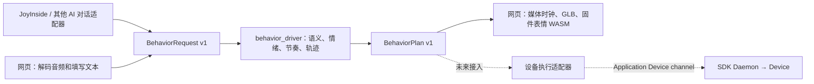

# WatcheRobot 说话动作实验室

独立的 SDK Application。用真实 GLB 和固件表情算法预览语音、七种情绪、嘴部与两轴头部动作，内含供其他对话系统复用的行为编排核心。

当前为视觉预览：不控制设备、不启动 JoyInside 会话、不调用云端语义模型，也未采用强化学习。Manifest 只声明已经验收的 Windows 平台。

## 构建与运行

前端源码在客户端仓库，Python Application 和行为核心在 SDK 仓库。先在 workspace 的 `WatcheRobot_client/Watcher Desktop App` 安装现有 Node 依赖，然后执行：

```text
npm run build:joyinside-application
```

生成的 `web/` 包含真实模型、示例语音、WASM、许可和 `web-build.json` 资产哈希，不包含开发机路径。生成资源不提交 Git；每次制作可分发 Application 时必须重新构建，并随 Python 源码一起打包。`.watcherignore` 保留 `web/`，排除测试、缓存与构建临时目录。

在 SDK Python 环境中运行以下跨平台命令：

```text
watcherobot app check examples/speaking_motion_lab
watcherobot app run examples/speaking_motion_lab
```

Daemon 注入 ApplicationContext 的 Desktop 和 Device channel，应用开启本机随机 HTTP 端口并输出网页地址，通常自动打开浏览器。安装后的资源不依赖 Node、Vite 或客户端源码仓库。不要直接执行 `app.py`。

`app run` 会选择当前用户 Runtime 的 Application；同一 Daemon 同时只有一个 Application。应用运行时不支持的 Desktop 业务帧会被安全忽略，包括麦克风快捷键，不会绕过 Application 直达设备。需要保留桌面当前会话时，使用 SDK 文档中的自定义 App Store / `run-installed` 隔离验收流程。

`WATCHER_BEHAVIOR_LAB_NO_BROWSER=1` 可关闭自动打开浏览器；仍可使用日志地址。`watcherobot app stop` 停止应用和其 HTTP 服务，Daemon 继续运行。

## 核心与适配器



| 模块 | 职责 |
| --- | --- |
| `behavior_driver/contracts.py` | 版本化输入与输出、边界校验、不可变数据 |
| `semantics.py` | 本地词汇规则；外部意图可覆盖 |
| `planner.py` | 时间对齐、情绪姿态、节奏与平滑曲线 |
| `driver.py` | 唯一编排入口、固定步长帧和按媒体时间采样 |
| `web_server.py` | 本机 HTTP 输入适配器和静态资源服务 |
| `application.py` / `app.py` | SDK 生命周期、启动和退出；不实现 Daemon |
| 客户端 `shared/behavior-driver` | TS 合同、HTTP 客户端和已生成帧采样；不另做语义规划 |

纯核心不依赖 SDK、JoyInside、React、Three.js、HTTP 或设备连接，也不持有播放时钟。不同 AI / TTS 供应商应转换到同一输入合同。显示或设备执行只消费输出，不各自生成一套动作。

## 输入与输出合同

`BehaviorRequest.from_dict()` 接收 `watche.behavior.request.v1`：

```python
from behavior_driver import BehaviorDriver, BehaviorRequest

request = BehaviorRequest.from_dict({
    "schema": "watche.behavior.request.v1",
    "audio": {"durationMs": 4000, "stepMs": 20, "levels": [200] * 200},
    "transcript": "是的。不可以。",
    "emotionMode": "auto", "emotionTarget": 0, "strength": 0.85,
    "segments": [
        {"text": "是的。", "startMs": 0, "endMs": 1800, "intent": "affirm", "emotion": 2},
        {"text": "不可以。", "startMs": 2200, "endMs": 4000, "intent": "deny"},
    ],
})
driver = BehaviorDriver()
plan = driver.plan(request)
frame = driver.sample(plan, 1000)  # 由调用方提供媒体时间，单位 ms
```

音频包络为每 20 ms 一项、范围 0–1000；最长 60 秒。文本或带时间戳片段总长最多 2000 字，片段最多 128 个，按时间排列且不重叠。意图枚举：`greeting / affirm / deny / question / emphasis / neutral`。情绪编号：0 平静、1 微笑、2 开心、3 生气、4 专注、5 伤心、6 无语。

有 `segments` 时保留外部时间戳，`alignment=provided`；其意图、情绪提示优先于词汇推断。`emotionMode=manual` 时手动情绪统一覆盖。未提供片段时按文本字数和有声时间估算对齐，标为 `estimated`；缺少文本时标为 `no-text`，只跟随声音节奏。估算不是逐字强制对齐，复杂语义可能误判。

输出 `watche.behavior.plan.v1` 包含片段和每 40 ms 的 `BehaviorFrame`：

```json
{"timeMs": 1000, "panDeg": 90, "tiltDeg": 113, "mouthLevel": 500, "emotionTarget": 2, "speaking": true}
```

默认预览中位为 90° / 108°，角度范围 76–104° / 100–122°。嘴部输入放大 2.5 倍并限制在 1000。片段两端平滑回位，短片段减小动作；声音停顿时闭嘴但保留说话状态，整段结束后 `speaking=false`、目标情绪归零、头部回中，并保留 1200 ms 让固件表情收尾。暂停冻结媒体时钟；回到开头、倒拖或替换计划会重放固件状态。预览角度尚未完成实机标定。

网页只把包络、文本和参数发送到本机 `/api/behavior/plan`，原始音频在浏览器解码。接口使用该次应用运行的随机凭据和同源校验；静态服务仅暴露 `web/`。

## 后续聊天接入

默认 JoyInside 与其他 AI 对话可以提供语音包络、文本、TTS 时间戳、结构化意图/情绪，再调用同一个 `BehaviorDriver`。当前处理完整的短语音片段；流式音频队列、打断、连续多轮过渡与设备延迟补偿，需要在会话适配层实现并验收，不能把它们隐藏在供应商专属轨迹逻辑里。

未来设备适配器须通过当前 Application 的 Device channel，经 SDK Daemon 到设备；桌面业务进入 Application Desktop channel，不增加 Daemon 按业务 `type` 分流的例外。聊天接入和真机执行尚未实现，本轮只完成 Application 与通用核心。

## 验证

先生成 `web/`，再在 SDK 环境执行：

```text
python -m pytest examples/speaking_motion_lab/tests -q
watcherobot app check examples/speaking_motion_lab
```

客户端：

```text
npm run test:joyinside-preview
npm run typecheck:joyinside-preview
npm run build:joyinside-application
```

Python 测试覆盖合同、语义、外部提示、时间对齐、两轴限制与连续性、同一计划确定性、HTTP 适配以及发布文件快照在 SDK Daemon 下的启动和停止。网页测试覆盖模型层级、WASM、媒体时钟、倒拖、合同客户端与构建替换。平台入口 `.ps1` / `.sh` 委托同一 Node 实现。

## 许可

生成网页保留 `LICENSE.KuroBlob-AI.txt` 和 `firmware-source.json`；表情算法来自现有 ESP32 纯 C 核心，模型资产继续使用客户端原资源。可分发 Application 包必须保留这些文件。
